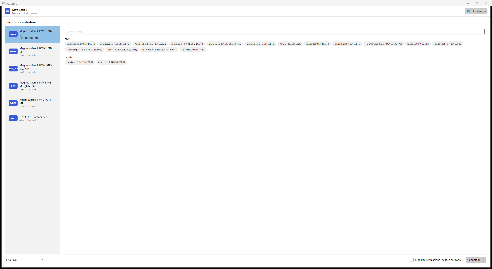
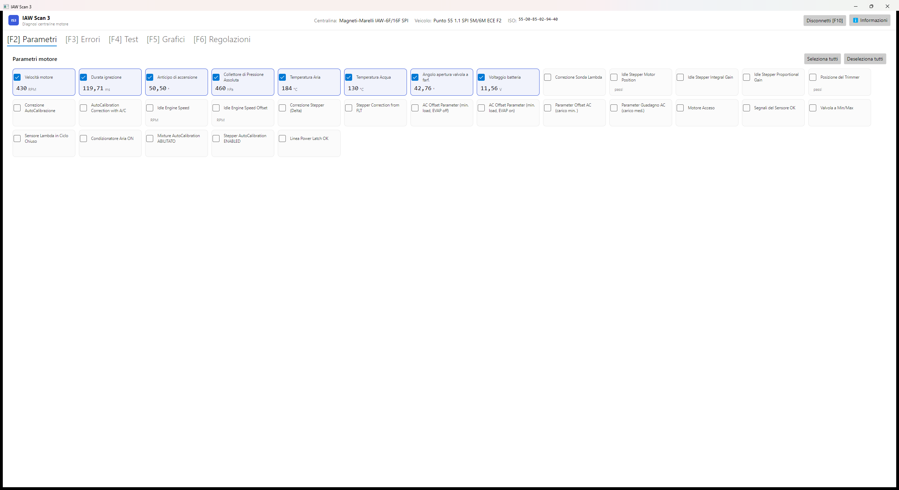
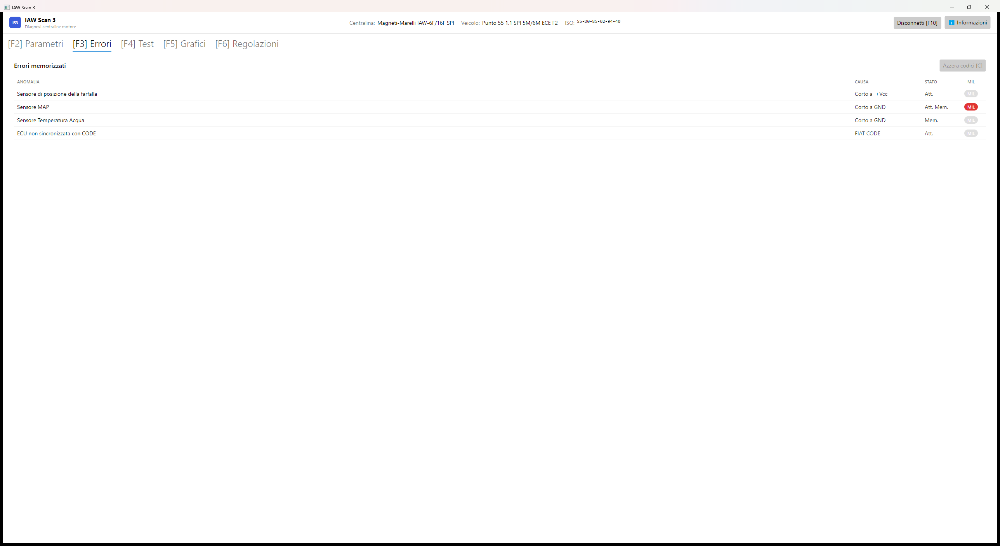
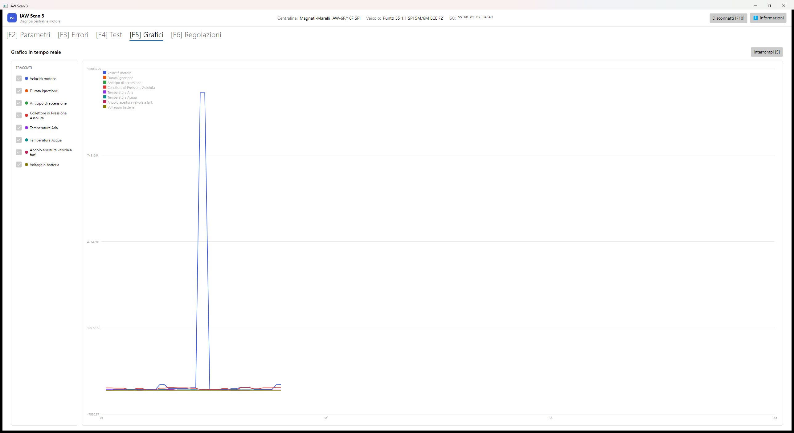
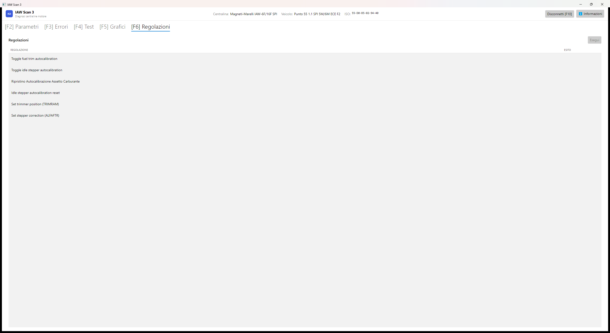

# IAW Scan 3

Diagnostic software for FIAT/Lancia/Alfa Romeo OBD-I engine control units (Marelli IAW 6F/8F/16F/18F/18FD/04K.P8 and the FIAT CODE immobiliser), communicating over an ISO-KKL (K-line) interface.

**This project starts from the official, last upstream release of [IAW Scan 2](http://iaw-scan2.sourceforge.net) v0.85 by Tomasz Orczyk ("TzOk")** — itself the successor of the original IAW ECU Scan. Nothing about the ECU communication protocol has been reverse-engineered from scratch here: that work, already field-proven for over a decade, comes from the upstream project. See the [Supported vehicles and ECUs](#supported-vehicles-and-ecus) section below for the complete vehicle compatibility list, [readme.txt](readme.txt) for the original upstream changelog, and [CHANGELOG.md](CHANGELOG.md) for a plain-language summary of what this fork changes on top of it.

> **This is a first beta.** The new interface below is functionally complete but not yet verified against real hardware for every supported ECU - see "Testing status" for exactly what has and hasn't been confirmed. Feedback and issue reports are very welcome. **Provided with no warranty of any kind - use at your own risk** (see License below).

## Screenshots

The new cross-platform interface (`IES_3.Avalonia`), shown here in simulation mode (no ECU hardware needed):

<table>
<tr>
<td width="50%"><br><sub>ECU and vehicle selection, connection setup</sub></td>
<td width="50%"><br><sub>Live engine parameters, as a compact tile grid</sub></td>
</tr>
<tr>
<td width="50%"><br><sub>Stored error codes, with MIL status</sub></td>
<td width="50%"><br><sub>Real-time graph with CSV export</sub></td>
</tr>
<tr>
<td width="50%"><br><sub>Actuator adjustments</sub></td>
<td width="50%"></td>
</tr>
</table>

## Supported vehicles and ECUs

IAW Scan 3 is designed for 1990s Italian OBD-I vehicles (Fiat, Lancia, Alfa Romeo) equipped with **Magneti-Marelli / Weber-Marelli IAW** engine management systems and the **FIAT CODE** immobiliser, communicating over an ISO-KKL (K-line) interface via the 3-pin Fiat diagnostic port.

### By vehicle

#### Fiat
| Model | Engine / Specification | Fuel System | ECU |
|---|---|---|---|
| **Cinquecento** | 899cc (0.9) SPI (ECE F2) | SPI | Magneti-Marelli IAW-6F / 16F |
| **Cinquecento Sporting** | 1108cc (1.1) FIRE SPI (ECE F2) | SPI | Magneti-Marelli IAW-6F / 16F |
| **Seicento** | 899cc (0.9) SPI (CM, F2) | SPI | Magneti-Marelli IAW-6F / 16F |
| **Panda** (141) | 899cc SPI (ECE F2) | SPI | Magneti-Marelli IAW-6F / 16F |
| **Panda** (141) | 1000cc (1.0) FIRE SPI (ECOL / ECE F2) | SPI | Magneti-Marelli IAW-6F / 16F |
| **Panda / Selecta** (141) | 1108cc (1.1) FIRE SPI CA (ECE F2) | SPI | Magneti-Marelli IAW-6F / 16F |
| **Panda 4x4** (141) | 1108cc (1.1) FIRE SPI 4x4 (ECE F2) | SPI | Magneti-Marelli IAW-6F / 16F |
| **Punto 55** (176) | 1.1 FIRE SPI (5M/6M, ECE F2 / Em.04 Est Europa) | SPI | Magneti-Marelli IAW-6F / 16F |
| **Punto 60 / Selecta** (176) | 1.2 (1242cc) FIRE SPI (CM, ECE F2 T.i.T.) | SPI | Magneti-Marelli IAW-6F / 16F |
| **Punto 75** (176) | 1.2 (1242cc) FIRE 8V MPI (ECE F2 / ECOL) | MPI | Magneti-Marelli IAW-8F / 18F |
| **Punto 85 16V** (176) | 1.2 (1242cc) FIRE 16V MPI (CEE F2) | MPI | Magneti-Marelli IAW-18FD |
| **Coupé 2.0 16V** | 2.0 16V N/A (Lampredi / Pratola Serra) | MPI | Weber-Marelli IAW-04K.P8 |
| **Coupé 2.0 16V Turbo** | 2.0 16V Turbo / Plus (T/C, ESSE) | MPI | Weber-Marelli IAW-04K.P8 |
| **Tipo** | 1.4 / 1372cc SPI (ECE 04, TOFAS) | SPI | Magneti-Marelli IAW-6F / 16F |
| **Tipo / Tempra** | 1.6 SPI (USA'83 / Em.04, TOFAS) | SPI | Magneti-Marelli IAW-6F / 16F |
| **Tipo / Tempra** | 1.8 8V MPI (Bn/Sw, ECE F2) | MPI | Magneti-Marelli IAW-8F / 18F |
| **Tipo 2000 16V** | 2.0 16V Sedicivalvole (Tipo 2.0 16V) | MPI | Weber-Marelli IAW-04K.P8 |
| **Tempra 2.0** | 2.0 8V (M/T, A/T, 4x4) | MPI | Weber-Marelli IAW-04K.P8 |
| **Palio** | 1.0 8V (IAW-1G7SD) | MPI | Magneti-Marelli IAW-18FD / 1G7 |
| **Palio** | 1.2 FIRE 8V (ECE F2) | MPI | Magneti-Marelli IAW-8F / 18F |
| **Siena** | 1.4 8V (IAW-1G7SP) | MPI | Magneti-Marelli IAW-18FD / 1G7 |
| **131** (TOFAS / Şahin / Doğan / Kartal) | 1.6 SPI USA'83 (Bn/Sw) | SPI | Magneti-Marelli IAW-6F / 16F |

#### Lancia
| Model | Engine / Specification | Fuel System | ECU |
|---|---|---|---|
| **Y / Ypsilon** (840) | 1.2 (1242cc) SPI (CM / CA, ECE F2) | SPI | Magneti-Marelli IAW-6F / 16F |
| **Delta II (Nuova Delta 836)** | 1.8 8V MPI (90 CV / Bn / Sw, ECE F2) | MPI | Magneti-Marelli IAW-8F / 18F |
| **Delta II (Nuova Delta 836)** | 2.0 16V N/A | MPI | Weber-Marelli IAW-04K.P8 |
| **Delta II HF Turbo (Nuova Delta 836)** | 2.0 16V Turbo / T/C (4x2) | MPI | Weber-Marelli IAW-04K.P8 |
| **Delta II (Nuova Delta 836)** | 2.0 8V T/C | MPI | Weber-Marelli IAW-04K.P8 |
| **Delta HF Integrale** | Evoluzione 2.0 16V 4x4 (Evo 1 / Evo 2 Kat ECO) | MPI | Weber-Marelli IAW-04K.P8 |
| **Dedra** (835) | 1.8 8V MPI (Bn / Sw, ECE F2) | MPI | Magneti-Marelli IAW-8F / 18F |
| **Dedra** (835) | 2.0 8V (A/T) | MPI | Weber-Marelli IAW-04K.P8 |
| **Dedra** (835) | 2.0 16V FWD & Integrale 4x4 | MPI | Weber-Marelli IAW-04K.P8 |

#### Alfa Romeo
| Model | Engine / Specification | Fuel System | ECU |
|---|---|---|---|
| **145** (930) | 1.3 / 1351cc Boxer MPI (ECE F2) | MPI | Magneti-Marelli IAW-8F / 18F |
| **146** (930) | 1.3 / 1351cc Boxer MPI (ECE F2) | MPI | Magneti-Marelli IAW-8F / 18F |
| **155** (167) | 2.0 16V Q4 / 4x4 Turbo | MPI | Weber-Marelli IAW-04K.P8 |
| **33** (907) | 1.3 / 1360cc Boxer MPI CM (Late Boxer) | MPI | Magneti-Marelli IAW-8F.68 |

### Supported ECU systems

| ECU Identifier | Fuel Injection | Diagnostic Protocol | Typical Applications |
|---|---|---|---|
| **Magneti-Marelli IAW-6F / IAW-16F** | Single-Point (SPI) | ISO 9141 (K-Line), 7680 baud | Fiat Cinquecento, Seicento, Panda, Punto 55/60, Tipo/Tempra 1.4/1.6, Lancia Y 1.2 |
| **Magneti-Marelli IAW-8F / IAW-18F** | Multi-Point (MPI) | ISO 9141 (K-Line), 7680 baud | Fiat Punto 75, Palio 1.2, Tipo/Tempra 1.8, Lancia Delta/Dedra 1.8, Alfa Romeo 145/146 1.3 Boxer |
| **Magneti-Marelli IAW-18FD / IAW-1G7** | Multi-Point (MPI) | ISO 9141 (K-Line), 7680 baud | Fiat Punto 85 16V (1.2 FIRE 16V), Palio 1.0, Siena 1.4 |
| **Magneti-Marelli IAW-8F.68** | Multi-Point (MPI) | ISO 9141 (K-Line), 7680 baud | Alfa Romeo 33 1.3 Boxer |
| **Weber-Marelli IAW-04K.P8** | Multi-Point (MPI) | ISO 9141 (K-Line), 7680 baud | Fiat Coupé 2.0 16V & Turbo, Tipo 2.0 16V, Lancia Delta HF Integrale Evo, Nuova Delta 2.0 16V/Turbo, Dedra 2.0 16V/Integrale, Alfa Romeo 155 Q4 |
| **FIAT CODE** | Factory Immobiliser | ISO 9141 (K-Line), 7680 baud | First-generation immobiliser diagnostic readouts and error status across all equipped vehicles |

### Diagnostic interface & adapter cable

To connect your computer to these pre-OBD-II (OBD-I) vehicles, standard ELM327 Bluetooth/USB scanners will **not** work. You need:

1. **USB-to-K-line (ISO-KKL) interface cable:** A standard **VAG-COM KKL 409.1** USB cable (adapters using the genuine **FTDI FT232** chipset are strongly recommended for timing stability).
2. **Fiat 3-pin to OBD-II 16-pin adapter:** Pre-OBD-II Fiat group vehicles use a triangular **3-pin diagnostic connector** (usually found under the hood near the firewall or strut turret, or under the passenger glovebox for the FIAT CODE immobiliser unit). This adapter includes red/black alligator clips that connect directly to the vehicle's **12V battery**, because the 3-pin port does not supply 12V power to the diagnostic interface.

## Goal

Give IAW Scan **longevity**: a supported, modern runtime instead of .NET Framework 2.0 (unmaintained since 2015), and a UI that isn't tied to Windows. Concretely, that means:

- running on a **long-term-supported .NET version** rather than a dead one;
- a **cross-platform UI** (Windows/Linux/macOS) so the tool isn't limited to a Windows laptop — including **Linux on a Raspberry Pi**, for a small, cheap, permanently-installed diagnostic unit that can live **in the car** rather than being carried in and out each time.

## Diagnostic accuracy

**The diagnostic engine itself is not being changed.** Every value this tool reads and decodes (RPM, temperatures, pressures, error codes, and so on) uses exactly the same formulas as the original IAW Scan 2 — nothing here has been recalculated or reinterpreted. If a genuine bug in a formula is ever found and fixed, it will be called out explicitly in the changelog as such, never silently. What changes in this fork is how you interact with the software and what it runs on — not what it tells you about your engine.

## Supported operating systems

|                          | Original IAW Scan 2 (v0.85) | This fork |
|--------------------------|------------------------------|-----------|
| Windows                  | Windows 2000 through 7       | Any current Windows, via the .NET 10 Desktop Runtime |
| Linux (incl. Raspberry Pi) | Not supported              | Goal of this fork - see status note below |
| macOS                    | Not supported                | Goal of this fork - see status note below |

**Status note:** the new cross-platform UI (`IES_3.Avalonia`) is built entirely on packages that run on Linux and macOS, but it has only actually been run and tested on Windows so far. Linux/Raspberry Pi support is the direction this project is heading in, not yet a verified, ready-to-use feature.

**Specifically about Linux + Raspberry Pi:** the whole point of that port is a small, cheap touchscreen unit that lives permanently in the car - but the piece that actually matters for that use case, talking to the USB K-line interface over serial on Linux, **has not been tested at all**. Only the UI itself (running with no hardware attached, in simulation mode) has been confirmed to start on Linux. Whether the interface is even detected, and whether reading/writing over it behaves the same as on Windows, is genuinely unknown right now. If you try this on a Raspberry Pi (or any Linux box) with real hardware, please [open an issue](https://github.com/intilinux-eng/iaw-scan-3/issues) either way - a "it doesn't see the interface" report is just as useful as a "it works" one.

**What you need either way:** a USB-to-K-line (ISO-KKL) diagnostic interface cable and its driver (the same requirement as the original tool). On Linux, this typically also means adding your user to the `dialout` group so it can access the serial port without extra privileges.

## Testing status

Developed and tested primarily on a **Fiat Coupé 2.0 16V naturally aspirated** (Marelli IAW-04K.P8), **on Windows**, using the new interface's simulation mode plus real-hardware runs on that one vehicle. Other supported ECUs/vehicles come from the upstream project's own reverse-engineering and haven't all been re-verified against real hardware in this fork yet — see [CHANGELOG.md](CHANGELOG.md) for what has been specifically confirmed working or removed (e.g. automatic ECU detection, dropped after it proved unreliable on real hardware). **Linux has only been tested for the UI itself starting up, never against real ECU hardware** — see the Linux/Raspberry Pi note above.

## Project structure

- **`IES_3/`** — the original WinForms UI, ported to .NET 10 (mechanical port, behavior unchanged from upstream v0.85).
- **`IES_3.Core/`** — shared library with the ECU protocol/communication logic and localized strings, used by both UIs below. Its source files (the actual ECU decoding logic) come unchanged from the original IES_2 codebase, just relocated here.
- **`IES_3.Avalonia/`** — new cross-platform UI (Windows/Linux/macOS) built with [Avalonia](https://avaloniaui.net/) and MVVM. All the original screens are ported: ECU/vehicle selection and connecting, live parameters, error codes, actuator tests, a real-time graph with CSV export, and adjustments.

## Beta downloads

Pre-built, self-contained packages of the new cross-platform interface (`IES_3.Avalonia`) - no need to install .NET yourself - are published on demand to a rolling **[Beta release](https://github.com/intilinux-eng/iaw-scan-3/releases/tag/beta)**: a Windows `.exe` and a Linux `.deb`. These are beta builds straight from `main`, not tested releases - see "Testing status" below for what has and hasn't been confirmed on real hardware. A proper versioned-release process (release branches, version tags) will come later. Provided with no warranty, as with the rest of the project - see License.

## Building

Requires the [.NET 10 SDK](https://dotnet.microsoft.com/download) or later.

```
dotnet build IES_3.sln
```

Run the original WinForms UI (Windows only):

```
dotnet run --project IES_3/IES_3.csproj
```

Run the new cross-platform UI:

```
dotnet run --project IES_3.Avalonia/IES_3.Avalonia.csproj
```

Both UIs support a simulation mode that requires no ECU hardware (a checkbox in the new UI; Ctrl+click the Connect button, or Ctrl+F10, in the WinForms UI).

## License

Modified BSD license (see [license.txt](license.txt)), Copyright (c) 2011, Tomasz Orczyk. The WinForms UI's chart control, [ZedGraph](https://github.com/discomurray/ZedGraph), is LGPLv3-licensed and consumed as an unmodified NuGet package.

**In plain words: no warranty.** This software is provided "as is", with no warranty of any kind, express or implied - including no warranty that it will correctly diagnose your vehicle. The author(s) and contributors are not liable for any damage, to your car or otherwise, arising from its use. See [license.txt](license.txt) for the exact legal text.
